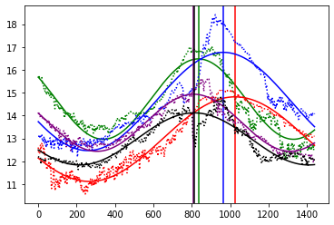

```python
import numpy as np
%matplotlib inline
import matplotlib.pyplot as plt
from scipy.optimize import curve_fit
```

- some analyzis of the wheather data tracked by tortoise service
- april -> oct
- very weak model (sin(...)) works a bit
- let's see how this evolves over the next couple of months


```python
def parse_f(x):
    return float(x.strip() or -100)
def parse_d(x):
    # len("2020-04-27 09:19:29"): 19
    return x.decode("utf-8").strip()[0:19]
raw = np.loadtxt("temp_outside_2020-10-01", 
                 delimiter="|",
                 comments="(",
                 converters={0: parse_d, 1: parse_f, 2: parse_f},
                 dtype={'names': ('date', 'temperature', 'humidity'), 'formats': ('datetime64[s]', 'f4', 'f4')})
```


```python
# start, end, number of days
(raw[0], raw[-1], float(raw.shape[0]) / 60 / 24)
```


    (('2020-04-27T09:19:29', 13.72, 52.24),
     ('2020-10-01T14:11:29', 16.9, 92.16),
     156.71180555555557)


```python
shape = (156, 60 * 24)
start = np.datetime64("2020-04-28T00:00:00")

# detect raw start index
index0 = None
for i in range(raw.shape[0]):
    if raw[i][0] >= start:
        index0 = i
        break
if index0 is None:
    raise Exception("could not detect starting index")

# initialize state
t1 = raw[index0].copy()
t1[0] = start
t2 = raw[index0]
i = index0 + 1
now = start

# create rasterized data grid using linear interpolation
data = np.zeros(shape, dtype=np.float32)
for (k,l) in [(k,l) for k in range(shape[0]) for l in range(shape[1])]:
    if raw[i][1] < -99:
        i += 1
    elif now >= t2[0]:
        t1, t2 = (t2, raw[i])
        i += 1
    data[k][l] = t2[1] - (t2[0] - now) / (t2[0] - t1[0]) * (t2[1] - t1[1])
    now += 60
```


```python
# show data
plt.imshow(data, aspect="auto", cmap="jet")
plt.show()
```


    

    


```python
from numpy.fft import fft
wdata = fft(data, axis=1)
plt.imshow(np.log(np.abs(wdata)), aspect="auto", cmap="jet")
plt.show()
```


    

    


```python
# try simple sin fit
def f(p, b, a, p0, w):
    return b + a * np.sin(w * p + p0)
sinfit = np.zeros_like(data)
params = np.zeros((data.shape[0], 4), dtype=np.float32)
for i in range(data.shape[0]):
    try:
        popt, _ = curve_fit(f, p, data[i], (15, 2, 3.14, 0.004), bounds=([-10, 0, 2, 0.002], [40, 50, 4, 0.008]))
        params[i] = popt
        sinfit[i] = f(p, *popt)
    except RuntimeError:
        sinfit[i] = sinfit[i - 1]
        params[i] = params[i - 1]
```


```python
# simple fit result + peak (green) plotting
# d/dx (a + b * sin(w * t + c)) = b * w * cos(w*t+c)
# b * w * cos(w * t + c) = 0
# cos(w * t + c) = 0 <=> t = (1 + 2 * n) * pi / w - c / w = 1 / w * ((1 + 2 * n) * pi - c)
dx0 = 1.0 / params[:,3] * (2.5 * np.pi - params[:,2])
plt.imshow(data, aspect="auto", cmap="seismic")
plt.plot(dx0, np.arange(0, params.shape[0], 1), color="green")
plt.show()
```


    

    


```python
# compare simple sinus fit to original data
plt.plot(sinfit[0], color="green")
plt.plot(data[0], ':', color="green")
plt.axvline(dx0[0], color="green")

plt.plot(sinfit[1], color="red")
plt.plot(data[1], ':', color="red")
plt.axvline(dx0[1], color="red")

plt.plot(sinfit[2], color="blue")
plt.plot(data[2], ':', color="blue")
plt.axvline(dx0[2], color="blue")

plt.plot(sinfit[3], color="purple")
plt.plot(data[3], ':', color="purple")
plt.axvline(dx0[3], color="purple")

plt.plot(sinfit[4], color="black")
plt.plot(data[4], ':', color="black")
plt.axvline(dx0[4], color="black")

plt.show()
```


    

    


```python
# check whether the data was transformed to grid correctly
plt.plot(np.concatenate((grid[24], grid[25], grid[26], grid[27])))
plt.plot(raw['temperature'][(24*60*24+index0-128):(28*60*24+index0-128)])
plt.show()
```


    

    


```python
# magic numpy datetime arithmetic works pretty well
np.datetime64("2020-04-28T00:00:00") + 60

d1 = np.datetime64("2020-04-28T00:00:00")
d2 = np.datetime64("2020-04-29T00:00:00")
d3 = np.datetime64("2020-04-28T06:00:00")
m = 1 - (d2 - d3) / (d2 - d1)

# use the derivate for linear shading the data into the grid
#
#               -----°x2
#         -x3---
#   ------
# °x1                
#
#  
# --------------------
# d1       d3        d2

x1 = 1
x2 = 3
x3 = x1 + m * (x2 - x1)
# x3 = x1 + (1 - (d2 - d3) / (d2 - d1)) * (x2 - x1)
# x3 = x2 - (d2 - d3) / (d2 - d1) * (x2 - x1)
(m, x3)
```
